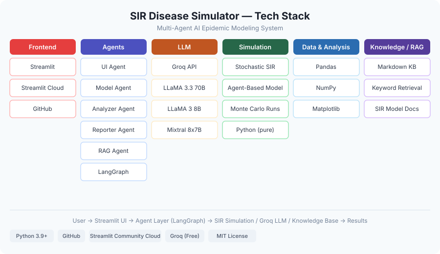

# Multi-Agent AI System for SIR Infectious Disease Modeling

A multi-agent AI system that lets users run, analyze, and query a stochastic agent-based **SIR (Susceptible–Infected–Recovered)** epidemic model through a conversational interface — deployed as an interactive web app via Streamlit.



---

## Live Demo

> **[Launch the app on Streamlit Community Cloud →](https://share.streamlit.io)**

No installation needed. The simulation and analysis tabs work out of the box. A free [Groq API key](https://console.groq.com) unlocks the AI-powered report and Q&A tabs.

---

## What It Does

This system answers questions about infectious disease spread by orchestrating six autonomous AI agents through a shared [LangGraph](https://github.com/langchain-ai/langgraph) workflow. Users can:

- **Run** stochastic SIR simulations with fully customizable parameters
- **Analyze** results — peak infection, spread rate, recovery dynamics, final state distributions
- **Ask** the Reporter Agent to generate plain-language summaries powered by an LLM
- **Learn** about SIR model assumptions, history, and real-world applications via a RAG agent

---

## System Architecture

The following diagram shows how the six AI agents are organized and how data flows between them:


Each user request is classified by intent and routed to the appropriate agent. The workflow below illustrates this intent-classification logic:


---

## AI Agents

| Agent | Role | Key Tools |
|---|---|---|
| **UI Agent** | Classifies user intent, manages parameter prompts | LLM (Groq) |
| **Model Agent** | Executes the SIR simulation | `sir_sim.py` |
| **Analyzer Agent** | Computes statistics from simulation logs | Pandas, NumPy |
| **Reporter Agent** | Generates natural-language summaries of results | LLM (Groq) |
| **RAG Agent** | Answers questions about model assumptions and disease spread | Keyword retrieval + LLM |
| **Control Agent** | Orchestrates agent routing via conditional edges | LangGraph |

### Agent Interaction Flow

1. **UI Agent** receives the user's message and classifies intent: `run`, `analyze`, `learn`, or `exit`
2. **Control Agent** (embedded in the LangGraph) routes to the appropriate downstream agent
3. **Model Agent** runs the SIR simulation and writes results to a log file
4. **Analyzer Agent** reads the log, computes requested statistics, and returns a results dictionary
5. **Reporter Agent** takes the analysis dictionary and generates a readable narrative via LLM
6. **RAG Agent** searches the built-in knowledge base and generates answers about model mechanics

---

## The SIR Simulation

The simulation engine (`src/sir_sim.py`) implements a **stochastic, agent-based SIR model**:

- A population of *N* agents is initialized with one infected individual
- At each timestep, agents are randomly shuffled into contact groups
- Susceptible agents become infected probabilistically based on how many infected agents share their group
- Infected agents recover probabilistically each step
- Multiple Monte Carlo runs are averaged to produce stable, distribution-aware statistics

**Configurable parameters:**

| Parameter | Description | Default |
|---|---|---|
| `num_agents` | Population size | 1,000 |
| `num_steps` | Simulation duration (days) | 28 |
| `num_runs` | Monte Carlo repetitions | 50 |
| `infection_prob` | Probability of infection per contact | 0.3 |
| `recovery_prob` | Probability of recovery per step | 0.1 |
| `infection_duration` | Duration of infection (steps) | 3 |
| `num_contacts` | Average group contact size | 10 |

---

## Project Structure

```
├── app.py                            # Streamlit web application
├── requirements.txt                  # Python dependencies
├── params.yaml                       # Default simulation parameters
├── tech_stack.svg                    # Tech stack diagram
├── .streamlit/
│   ├── config.toml                   # Streamlit configuration
│   └── secrets.toml.example          # API key template
├── logs/                             # Simulation output CSVs (generated at runtime)
└── src/
    ├── sir_sim.py                    # SIR simulation engine
    ├── main_graph.py                 # LangGraph orchestration (CLI entry point)
    ├── agents/
    │   ├── ui_agent.py
    │   ├── model_agent.py
    │   ├── analyzer_agent.py
    │   ├── reporter_agent.py
    │   └── rag_agent.py
    ├── utils/
    │   ├── llm_utils.py              # Unified LLM client (Ollama + Groq)
    │   ├── analysis_tools.py         # Statistical analysis toolkit
    │   └── config_loader.py
    └── knowledge/
        └── sir_model_information.md  # RAG knowledge base
```
---

## Agentic AI vs. Modular Programming

A core design question behind this project: *what actually separates an AI agent from a regular function?*

Traditional modular programming breaks a program into independent, reusable functions. Agentic AI shares this structure — but adds three properties that transform modules into autonomous agents:

1. **Encapsulated reasoning** — each agent uses an LLM to interpret inputs and decide how to respond
2. **Dynamic planning** — agents can delegate, adjust, or re-route based on context
3. **Independent operation** — agents act without being explicitly told every step

This project uses plain Python classes for deterministic work (simulation, statistical analysis) and LLM-powered agents for tasks requiring language understanding (intent classification, report generation, Q&A). The combination is orchestrated by LangGraph's stateful graph framework.

---

## References

- Kermack, W. O. & McKendrick, A. G. (1927). *A Contribution to the Mathematical Theory of Epidemics.* Proceedings of the Royal Society of London.
- [LangGraph Documentation](https://langchain-ai.github.io/langgraph/)
- [Groq API](https://console.groq.com)
- [Streamlit Documentation](https://docs.streamlit.io)
